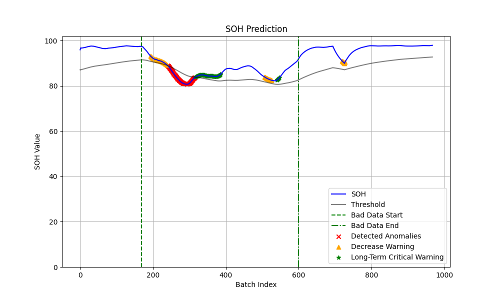

# State of Health Estimation with LLM

## 0 引言

仓库主要实现利用设备的电流、电压或其他特征参数，进行 **健康度实时检测** ，结合RAG等技术，利用LLM进行分析诊断，进行华为昇腾服务器的本地部署

主要包含三个文件夹

- olora_finetuning：微调LLM实现LLM基于设备电气参数的健康度预测
- soh_classification：基于自编码器和LLM的健康度实时检测
- soh_hypr01：基于自编码器和LLM，使用实测数据进行效果评估

基于**自编码器**和LLM的方法兼顾了实时性与准确性要求，作为主要讲述对象

### 数据集

- 仿真数据：某航空航天舱段仿真数据，包含舵机参数、GPS坐标、电量等40维特征
- 实测数据：通过加热等操作破坏Nvidia AGX Xavier，实时测量破坏前后的电压、电流、温度等参数

### 运行环境

- PC1：一台Macbook Air（M4）

- PC2：华为昇腾Atlas 300I Duo推理服务器

### 健康度检测

健康度模型是一个预训练的 **自编码器**，支持最多40维（超出维度需要重新训练）特征的处理。

- 模型首先基于正常样本重构得到健康样本空间
- 在实时检测时，基于自编码器重构得到新样本空间
- 通过计算健康样本空间与重构的新样本空间之间的 **重构误差**，映射得到健康度数值

### 预警类型

目前支持三种预警类型的实时更新



- 健康度低于阈值：图中红色部分，表示健康度已经低于阈值
- 健康度持续下降：图中黄色部分，表示健康度在以往M个时间点来看呈下降趋势
- 健康度长期濒临阈值：图中绿色部分，表示健康度近期有N个时间点濒临阈值

### 可用性预测

实现了**模块级**和**系统级**的设备可用时长预测

- 模块级：基于时变的线性模型预测健康度降为0的剩余时间
- 系统级：基于前备知识的树型可用时长预测

### 其他技术

- 自适应阈值：基于PID控制实现了阈值自适应变化，提升模型在变化环境下的稳定预警
- RAG知识库：基于公开航空航天与故障检测的数据，实现一个简单的知识库供LLM使用
- Websocket通信：实现了基于Websocket的双PC数据通信，小PC用于部署健康度检测小模型，大模型部署在本地服务器中进行推理
- UI前端展示：实现了一个实时的UI前端，展示整体健康度检测结果

## soh_classification部署全流程

## 1 大模型推理环境配置

本节主要完成Docker服务安装，并使用Docker拉取MindIE镜像进行运行与配置，实现MindIE加速Atlas 300I Duo推理卡进行大模型推理。

### 1.1 Docker服务安装

- 安装基础依赖

```bash
sudo apt-get update
sudo apt-get install -y ca-certificates curl gnupg lsb-release
```

- 配置国内镜像云

```bash
# 添加阿里云GPG密钥
curl -fsSL https://mirrors.aliyun.com/docker-ce/linux/ubuntu/gpg | sudo gpg --dearmor -o /usr/share/keyrings/docker-archive-keyring.gpg
# 设置仓库
echo "deb [arch=$(dpkg --print-architecture) signed-by=/usr/share/keyrings/docker-archive-keyring.gpg] https://mirrors.aliyun.com/docker-ce/linux/ubuntu $(lsb_release -cs) stable" | sudo tee /etc/apt/sources.list.d/docker.list > /dev/null
# Ubuntu更新APT缓存
sudo apt-get update
```

- 安装Docker引擎

```bash
sudo apt-get install docker-ce docker-ce-cli containerd.io docker-compose-plugin
```

- 启动Docker服务

```bash
# 启动服务
sudo systemctl start docker

# 设置开机自启
sudo systemctl enable docker

# 验证服务状态
sudo systemctl status docker
```

- 配置镜像加速器

```bash
#创建配置文件目录（已存在可跳过）
sudo mkdir -p /etc/docker 
#通过命令行生成配置（推荐新手）
sudo tee /etc/docker/daemon.json <<-'EOF'
{
    "registry-mirrors": [
        "https://docker.m.daocloud.io",
        "https://docker.imgdb.de",
        "https://docker-0.unsee.tech",
        "https://docker.hlmirror.com"
    ]
}
EOF
#应用配置（必须执行）
sudo systemctl daemon-reload 
sudo systemctl restart docker 
```

### 1.2 拉取镜像

```bash
sudo docker pull swr.cn-south-1.myhuaweicloud.com/ascendhub/mindie:2.0.RC2-300I-Duo-py311-openeuler24.03-lts
```

### 1.3 运行镜像

```bash
sudo docker run -it -d --net=host --shm-size=8g \
    --privileged \
    --name mindie-container \
    --device=/dev/davinci_manager \
    --device=/dev/hisi_hdc \
    --device=/dev/devmm_svm \
    -v /usr/local/Ascend/driver:/usr/local/Ascend/driver:ro \
    -v /usr/local/sbin:/usr/local/sbin:ro \
    -v /data/datasets:/data/datasets:rw \
    swr.cn-south-1.myhuaweicloud.com/ascendhub/mindie:2.0.RC2-300I-Duo-py311-openeuler24.03-lts bash

# 查看状态
sudo docker logs mindie-container

sudo docker ps
```

### 1.4 进入容器

```bash
sudo docker exec -it mindie-container bash
```

#### 1.4.1 安装模型

- 在使用Atlas 300I DUO卡部署模型时，需要修改权重目录下的config.json文件，"torch_dtype"字段改为"float16"  

```bash
pip install huggingface-hub[cli]

export HF_ENDPOINT=https://hf-mirror.com

huggingface-cli download deepseek-ai/DeepSeek-R1-Distill-Qwen-1.5B --local-dir=/data/datasets/DeepSeek-R1-Distill-Qwen-1.5B
```

- 如果在宿主机下载，再挂载进镜像，需要在宿主机修复权限

```bash
sudo chown -R root:root /data/datasets/Qwen2.5-0.5B-Instruct
sudo chmod -R 750 /data/datasets/Qwen2.5-0.5B-Instruct
```

#### 1.4.2 服务化配置

#### 1.4.2.1 打开配置

```bash
vim /usr/local/Ascend/mindie/latest/mindie-service/conf/config.json
```

##### 1.4.2.2 对部分配置进行修改

```bash
{
...
"ServerConfig" :
{
...
"port" : 1040, #自定义
"managementPort" : 1041, #自定义
"metricsPort" : 1042, #自定义
...
"httpsEnabled" : false,
...
},

"BackendConfig": {
...
"npuDeviceIds" : [[0,1]],
...
"ModelDeployConfig":
{
"truncation" : false,
"ModelConfig" : [
{
...
"modelName" : "qwen",
"modelWeightPath" : "/data/datasets/DeepSeek-R1-Distill-Qwen-1.5B",
"worldSize" : 2,
...
}
]
},
}
}
```

##### 1.4.2.3 配置MindIE权限

按照如下指令进行修改，详细可参考https://www.hiascend.com/document/detail/zh/mindie/10RC2/envdeployment/instg/mindie_instg_0025.html

```bash
# 进入目录
cd /usr/local/Ascend/mindie/latest

chmod 750 mindie-service
chmod -R 550 mindie-service/bin
chmod -R 500 mindie-service/bin/mindieservice_backend_connector
chmod -R 550 mindie-service/lib
chmod -R 550 mindie-service/include/
chmod -R 550 mindie-service/scripts/
chmod 750 mindie-service/logs
chmod 750 mindie-service/conf
chmod 640 mindie-service/conf/config.json
chmod 700 mindie-service/security/
chmod -R 700 mindie-service/security/*

```

##### 1.4.2.4 拉起服务化

```bash
cd /usr/local/Ascend/mindie/latest/mindie-service

# 方案一：后台启动
nohup ./bin/mindieservice_daemon > output.log 2>&1 &

#方案二：直接启动
./bin/mindieservice_daemon
```

##### 1.4.2.5 新建窗口测试(VLLM接口)

输入以下指令进行服务功能测试，详见https://www.hiascend.com/document/detail/zh/mindie/100/mindieservice/servicedev/mindie_service0078.html

```bash
curl 127.0.0.1:1040/generate -d '{
"prompt": "What is deep learning?",
"max_tokens": 32,
"stream": false,
"do_sample":true,
"repetition_penalty": 1.00,
"temperature": 0.01,
"top_p": 0.001,
"top_k": 1,
"model": "qwen"
}'
```

可参考的测试Python代码如下(vLLM接口)

```python
url = "http://127.0.0.1:1040/generate"  # MindIE / vLLM 端口
headers = {"Content-Type": "application/json"}

# ------------------------------
# 请求体
# ------------------------------
payload = {
    "prompt": "What is deep learning?",
    "max_tokens": 512,
    "stream": False,           # 不流式
    "do_sample": True,
    "repetition_penalty": 1.00,
    "temperature": 0.01,
    "top_p": 0.001,
    "top_k": 1,
    "model": "qwen"
}

# ------------------------------
# 发起请求
# ------------------------------
response = requests.post(url, headers=headers, data=json.dumps(payload))
response.raise_for_status()

# ------------------------------
# 输出结果
# ------------------------------
data = response.json()
print(json.dumps(data, indent=2, ensure_ascii=False))
```

### 1.5 可能遇到的问题

#### 1.5.1 容器运行打开全日志

如果发现报错，但报错日志信息不全，请参考如下指令打开全日志

```bash
# 默认日志地址 ~/mindie/log
# 算子库日志 | 默认输出路径为“~/atb/log”

export ASDOPS_LOG_LEVEL=INFO

export ASDOPS_LOG_TO_FILE=1

export ASDOPS_LOG_TO_STDOUT=1
 

# 加速库日志 | 默认输出路径为“~/mindie/log/debug”

export ATB_LOG_LEVEL=INFO

export ATB_LOG_TO_FILE=1

export ATB_LOG_TO_STDOUT=1


# MindIE Service日志 | 默认输出路径为“~/mindie/log/debug”

export MINDIE_LOG_TO_FILE=1

export MINDIE_LOG_LEVEL=debug

export MINDIE_LOG_TO_STDOUT=1
 

# CANN日志收集 | 默认输出路径为 "~/ascend"

export ASCEND_GLOBAL_LOG_LEVEL=1
```

#### 1.5.2 config.json权限问题

```bash
chmod 750 /path-to-your-model-weights/config.json
```

#### 1.5.3 libmindieservice_llm_engine.so权限问题

```bash
chmod 440 /usr/local/Ascend/mindie/latest/mindie-service/lib/libmindieservice_llm_engine.so
```

## 2 小模型运行环境配置

本节主要完成Python安装和torch_npu补丁安装。

### 2.1 依赖库下载

主要需要用到torch2.6版本，以及对应CANN版本的torch_npu扩展包，可使用如下指令一键创建运行环境：

```bash
#!/bin/bash

# conda 初始化
CONDA_BASE=$(conda info --base)
source "$CONDA_BASE/etc/profile.d/conda.sh"

# 文件名和下载地址
WHL_FILE="torch_npu-2.6.0-cp310-cp310-manylinux_2_28_aarch64.whl"
DOWNLOAD_URL="https://gitee.com/ascend/pytorch/releases/download/v7.1.0-pytorch2.6.0/torch_npu-2.6.0-cp310-cp310-manylinux_2_28_aarch64.whl"

echo "安装conda环境"

conda create -n soh python=3.10
conda init

echo "激活conda环境<soh>"
conda activate soh

# 1 基础深度学习库
echo "当前 Python 路径: $(which python)"
echo "切换 pip 源到清华镜像"
pip config set global.index-url https://pypi.tuna.tsinghua.edu.cn/simple

echo "安装官方pytorch"
python -m pip install numpy==1.26.0 
python -m pip install torch==2.6.0 

# 检查文件是否存在
if [ -f "$WHL_FILE" ]; then
    echo "$WHL_FILE 已存在，跳过下载。"
else
    echo "$WHL_FILE 不存在，开始下载..."
    wget "$DOWNLOAD_URL" -O "$WHL_FILE"
    if [ $? -ne 0 ]; then
        echo "下载失败，请检查网络或 URL。"
        exit 1
    fi
fi

# 安装 whl 文件
echo "安装 $WHL_FILE ..."
python -m pip install "$WHL_FILE"

python -m pip install torchvision==0.21.0

# 2 LLM依赖库
echo "安装LLM依赖库"
python -m pip install transformers==4.56.1 --no-deps
python -m pip install sentence_transformers==5.1.0 --no-deps

# 3 其他依赖库
echo "安装其他依赖库"
python -m pip install openai chromadb scikit-learn pandas matplotlib websockets

# 4 剩余依赖库
python -m pip install regex safetensors decorator psutil
```

### 2.2 依赖环境测试

下载好对应环境后，使用conda激活环境，并运行如下指令进行NPU测试：

```bash
python -c "import torch; import torch_npu; x=torch.randn(2, 2).npu(); print(x)"
```

若x的值被正常打印，依赖环境测试通过。

## 3 项目UI环境配置

本节主要完成nginx安装与UI前后端部署。

### 3.1 nginx安装

在Ubuntu系统下，使用如下命令进行nginx安装：

```bash
sudo apt-get update
sudo apt-get install nginx
```

安装完成后，进行版本号检查：

```bash
nginx -v
```

如果显示nginx版本，说明安装成功，接下来启动nginx：

```bash
sudo systemctl start nginx
```

### 3.2 UI前后端部署

#### 3.2.1 文件准备

检查以下文件是否存在，若不存在请复制配套文件。

- 前端项目路径: /home/lzh/dashboard

- 后端项目路径： /home/lzh/soh_classification

#### 3.2.2 nginx前端服务配置

进入nginx下载目录

```bash
cd /etc/nginx/sites-enabled/
```

编辑如下脚本，注意：

```bash
vim port.conf
```

```bash
# !/etc/nginx/sites-enabled/port.conf
server {
    listen 7788;
    listen 8060;

    location / {
        root /home/lzh/dashboard(此处为实际前端路径);
        index index.html index.htm;
    }
    location /ws/ {
       proxy_pass http://localhost:3016/ws/;
       proxy_connect_timeout 90;
       proxy_send_timeout 90;
       proxy_read_timeout 90;
       proxy_set_header Host $host;
       proxy_set_header X-Real-IP $remote_addr;
       proxy_set_header X-Forwarded-For $proxy_add_x_forwarded_for;
       proxy_set_header http_user_agent $http_user_agent;
       proxy_http_version 1.1;
       proxy_set_header Upgrade $http_upgrade;
       proxy_set_header Connection "Upgrade";
    }
}
```

完成后重启nginx服务，完成nginx配置

```bash### 3.3.3 
nginx -s reload
```

#### 3.3.3 后端UI启动

进入后端项目目录（/home/lzh/soh_classification），运行以下代码启动后端UI程序：

```bash
nohup python ws.py 2>&1 &
```

启动完成后可使用如下命令进行测试，查看是否获得UI前端信息:

```bash
curl http://localhost:7788
```

## 4 系统联调运行

本节主要完成两台主机PC1与PC2之间联调运行。  
PC1用于部署小模型，实时检测健康度大小，并将结果通过Websocket发送给PC2；  
PC2用于大模型推理，大模型对接收到的日志信息进行推理，并运行UI。

整个过程需要保证PC1与PC2网络通畅，数据传输有两种方式：网线直连和SSH端口转发。

### 4.1 网线直连方式

假设PC1与PC2通过网络连接，并分配好IP地址，分别如下：

```bash
192.168.1.30  # PC1的ip
192.168.1.40  # PC2的ip
```

假设使用8765端口进行Websocket通信  
分别在PC1和PC2端，修改后端代码的超参数进行运行：

```bash
# PC1端运行代码
python realtime_pred.py --peer_uri="ws://192.168.1.40:8765"   # PC1作为client

# PC2端运行代码
python llm_process.py --my_ip="192.168.1.40"  # PC2作为server
```

等待连接成功即可运行。

### 4.2 SSH端口转发

确保PC1和PC2都配置了SSH服务，此时无需手动分配IP地址  

假设使用8765端口进行Websocket通信，并假设PC2的内网IP为192.168.1.40
首先在PC1上新建一个终端，输入命令：

```bash
ssh -L 8765:localhost:8765 lzh@192.168.1.40
```

终端进入PC2后，进入后端目录，运行命令：

```python
python llm_process.py
```

并在PC1端运行命令：

```python
python realtime_pred.py
```

等待连接成功即可运行。

### 4.3 UI界面展示

通过在PC2端访问网页 http://localhost:7788 即可查看UI界面
